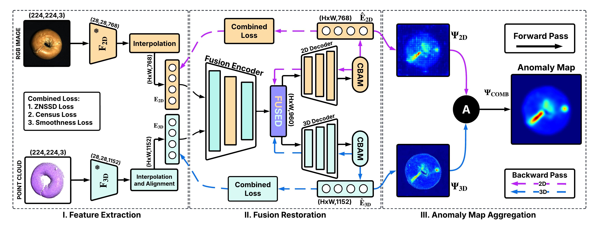

#  2D–3D Feature Fusion via Cross-Modal Latent Synthesis and Attention-Guided Restoration for Industrial Anomaly Detection

>  [Usman Ali](https://scholar.google.com.pk/citations?user=2A32xVQAAAAJ&hl=en&oi=sra), [Ali Zia](https://ali-zia.me/), [Abdul Rehman](https://scholar.google.com/citations?user=ZTuS-yUAAAAJ&hl=en), [Umer Ramzan](https://scholar.google.com/citations?user=D3AhoccAAAAJ&hl=en), [Zohaib Hassan](), [Talha Sattar](), [Jing Wang](https://scholar.google.com/citations?user=k33AbSYAAAAJ&hl=en&oi=sra), [Wei Xiang](https://scholar.google.com/citations?user=VxQUr90AAAAJ&hl=en)

## Abstract

Industrial anomaly detection (IAD) increasingly benefits from integrating 2D and 3D data, but robust cross-modal fusion remains challenging. We propose a novel unsupervised framework, Multi-Modal Attention-Driven Fusion Restoration (MAFR), which synthesises a unified latent space from RGB images and point clouds using a shared fusion encoder, followed by attention-guided, modality-specific decoders. Anomalies are localised by measuring reconstruction errors between input features and their restored counterparts. Evaluations on the MVTec 3D-AD and Eyecandies benchmarks demonstrate that MAFR achieves state-of-the-art results, with a mean I-AUROC of 0.972 and 0.901, respectively. The framework also exhibits strong performance in few-shot learning settings, and ablation studies confirm the critical roles of the fusion architecture and composite loss. MAFR offers a principled approach for fusing visual and geometric information, advancing the robustness and accuracy of industrial anomaly detection.



## Setup

- **Operating System**: Ubuntu 22.04  
- **Python**: 3.8  
- **PyTorch**: 1.13
- **Cuda**: 11.8

All required Python dependencies are listed in the `requirements.txt` file.  
To install them, run:

```bash
pip install -r requirements.txt
```

## Datasets

In our experiments, we employed two benchmark datasets featuring **RGB images** and **point clouds**:  
- [MVTec 3D-AD](https://www.mvtec.com/company/research/datasets/mvtec-3d-ad)  
- [Eyecandies](https://eyecan-ai.github.io/eyecandies/)
  
You can preprocess both datasets using the provided scripts in the `processing/` directory.

## Training

To train MAFR, refer to the examples provided in `mafr_training_mvtec.sh` and `mafr_training_eyecandies.sh`.

The script `mafr_training.py` is used to train the CFMs and supports the following options:
- `--dataset_path`: Root directory of the dataset.
- `--checkpoint_savepath`: Directory where checkpoints will be saved.
- `--class_name`: Target class for training.
- `--epochs_no`: Number of training epochs.
- `--batch_size`: Batch size used during training.


## Contacts

For inquiries, contact [211980009@gift.edu.pk](mailto:211980009@gift.edu.pk) or [usmanali@gift.edu.pk](mailto:usmanali@gift.edu.pk).

## Acknowledgements

We thank the authors of the following project for making their code publicly available, which supported our work:

- [CFM](https://github.com/CVLAB-Unibo/crossmodal-feature-mapping)
